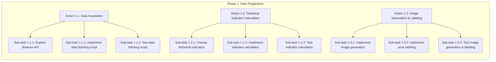

## Key Areas for Implementation

1. **Data Acquisition:** Fetch historical cryptocurrency price data from the Binance API.
2. **Technical Indicator Calculation:** Calculate RSI, SMA, and MACD.
3. **Candlestick Chart Image Generation:** Generate candlestick chart images with technical indicators.
4. **Price Movement Labeling:** Label images with 'BUY' or 'SELL' signals based on future price movements.
5. **CNN Model Training:** Train a CNN model using generated images and labels.
6. **Model Evaluation:** Evaluate the trained CNN model.

## Detailed Implementation Plan

**Project Goal:** Explore the feasibility of using CNNs for cryptocurrency price prediction using candlestick chart images with technical indicators.

**Overall Plan:** The project will be executed in 3 phases: Data Preparation, Model Development, and Model Evaluation.

**Phase 1: Data Preparation**

This phase has 3 main actions:

- **Action 1.1: Data Acquisition from Binance API:** Fetch historical cryptocurrency price data from Binance API and store it in CSV files.
- **Action 1.2: Technical Indicator Calculation:** Calculate technical indicators (RSI, SMA, MACD) using the fetched data.
- **Action 1.3: Candlestick Chart Image Generation and Labeling:** Generate candlestick chart images with technical indicators and label them with 'BUY' or 'SELL' signals.

**Implementation Process Visualization:**

**Action 1.1: Data Acquisition from Binance API**

- **Sub-task 1.1.1: Explore Binance API documentation**
    - **Goal:** Understand Binance API endpoints for historical data and authentication.
    - **Steps:**
        1. Read Binance API documentation for historical data endpoints.
        2. Identify necessary API endpoints and parameters for fetching candlestick data.
        3. Understand API authentication methods and rate limits.
    - **Output:** Documented API endpoints, parameters, authentication methods, and rate limits.
- **Sub-task 1.1.2: Implement data fetching script**
    - **Goal:** Write a Python script to fetch historical data from Binance API and save it to CSV files.
    - **Steps:**
        1. Install the `requests` library.
        2. Write a Python script to call Binance API endpoints to fetch historical candlestick data.
        3. Implement error handling for API responses and potential issues.
        4. Save fetched data to CSV files in the `data` directory, with filenames indicating the cryptocurrency symbol and time interval.
    - **Output:** Python script (`src/data_processing/fetch_binance_data.py`) to fetch data and save to CSV.
- **Sub-task 1.1.3: Test data fetching script**
    - **Goal:** Verify the data fetching script retrieves correct and complete data from the Binance API.
    - **Steps:**
        1. Run the `fetch_binance_data.py` script for a sample cryptocurrency symbol (e.g., BTCUSDT) and a short time interval (e.g., 1 hour).
        2. Inspect the generated CSV data in the `data` directory to ensure data correctness, completeness, and proper formatting.
    - **Output:** Verified data fetching script and sample CSV data file in the `data` directory.

**Action 1.2: Technical Indicator Calculation**

- **Sub-task 1.2.1: Choose technical indicators**
    - **Goal:** Select relevant technical indicators for price prediction.
    - **Steps:** N/A (Technical indicators are already defined: RSI, SMA, MACD).
    - **Output:** List of technical indicators to be calculated: RSI, SMA, MACD.
- **Sub-task 1.2.2: Implement technical indicator calculation**
    - **Goal:** Write Python functions to calculate RSI, SMA, and MACD using historical price data.
    - **Steps:**
        1. Install the `ta-lib` or `ta` library for technical indicator calculations.
        2. Write Python functions in `src/data_processing/technical_indicators.py` using `pandas` and `ta-lib` or `ta` to calculate RSI, SMA, and MACD for the fetched cryptocurrency data.
        3. Integrate these functions into the data processing pipeline to calculate indicators for each cryptocurrency dataset.
    - **Output:** Python functions for technical indicator calculation in `src/data_processing/technical_indicators.py`.
- **Sub-task 1.2.3: Test technical indicator calculation**
    - **Goal:** Verify that the implemented technical indicator calculation functions produce correct values.
    - **Steps:**
        1. Use sample cryptocurrency data from the fetched CSV files.
        2. Run the technical indicator calculation functions on the sample data.
        3. Compare the calculated indicator values with expected values from online technical indicator calculators or known implementations to ensure correctness.
    - **Output:** Verified technical indicator calculation functions.

**Action 1.3: Candlestick Chart Image Generation and Labeling**

- **Sub-task 1.3.1: Implement candlestick chart image generation**
    - **Goal:** Write a Python script to generate candlestick chart images incorporating technical indicators.
    - **Steps:**
        1. Install the `mplfinance` library for candlestick chart plotting.
        2. Write a Python script in `src/visualization/candlestick_chart.py` using `mplfinance` to generate candlestick chart images from the processed cryptocurrency data (including technical indicators).
        3. Configure the script to overlay the calculated technical indicators (RSI, SMA, MACD) onto the candlestick charts.
        4. Save the generated images in the `data/images` directory, with filenames corresponding to the cryptocurrency symbol and time window. Create `data/images` directory.
    - **Output:** Python script (`src/visualization/candlestick_chart.py`) to generate candlestick chart images and images saved in `data/images` directory.
- **Sub-task 1.3.2: Implement price movement labeling**
    - **Goal:** Label each candlestick chart image with a binary 'BUY' or 'SELL' signal based on future price movements.
    - **Steps:**
        1. Define labeling criteria: A 'BUY' signal is assigned if the price increases by 1% or more within the next hour, and a 'SELL' signal if the price decreases by 1% or more within the next hour. Otherwise, no signal (or ignore the image for binary classification).
        2. Write a Python script in `src/data_processing/label_images.py` to iterate through the processed data and apply the labeling criteria to generate labels for each candlestick chart image.
        3. Save the labels along with the corresponding image filenames for use in model training. This could be a CSV file or a separate metadata file.
    - **Output:** Python script (`src/data_processing/label_images.py`) for image labeling and a labeled dataset (e.g., CSV file) associating image filenames with 'BUY' or 'SELL' labels.
- **Sub-task 1.3.3: Test image generation and labeling**
    - **Goal:** Verify that the image generation and labeling scripts function correctly and produce accurate images and labels.
    - **Steps:**
        1. Run the `candlestick_chart.py` and `label_images.py` scripts on sample cryptocurrency data.
        2. Manually inspect a subset of the generated candlestick chart images to ensure they are correctly visualized and include the technical indicators.
        3. Verify the generated labels against the defined criteria for a sample of images to confirm the accuracy of the labeling process.
    - **Output:** Verified image generation and labeling scripts and sample labeled images in `data/images` directory with corresponding labels.